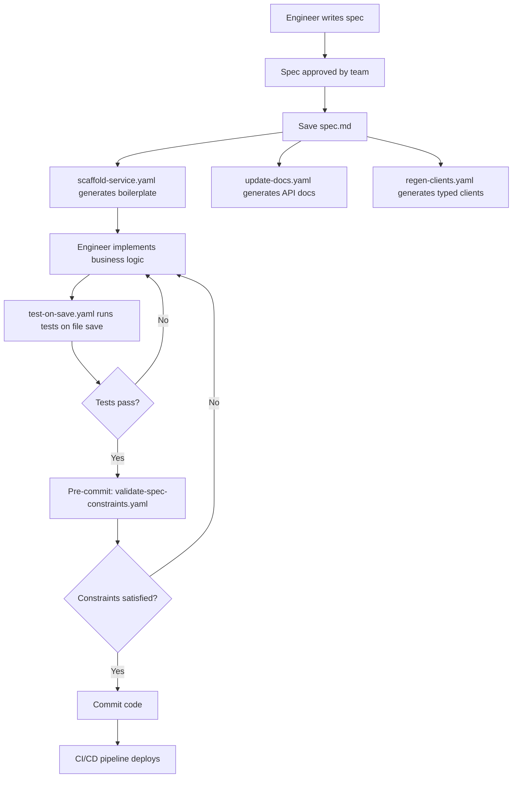

# Notification Service Specification

> **Example Project**: Demonstrates automation patterns where a single spec drives generation of implementation, tests, infrastructure, documentation, and client stubs
> 
> **Primary Concerns Addressed**: 
> - Engineer Burnout from Repetitive Work (Concern #3)
> - Rework from AI-Generated Code (Concern #6)
> 
> **Toolkit Artifacts Demonstrated**:
> - `toolkit/hooks/automation/update-docs.json` - Auto-update API documentation
> - `toolkit/hooks/automation/scaffold-service.json` - Generate service boilerplate
> - `toolkit/hooks/automation/regen-clients.json` - Regenerate client stubs
> - `toolkit/hooks/stability/test-on-save.json` - Immediate test execution
> - `toolkit/hooks/stability/validate-spec-constraints.json` - Verify code satisfies spec
> - `toolkit/steering/code-standards.md` - Coding patterns for all AI-generated code
> - `toolkit/steering/test-requirements.md` - Test quality standards

---

## Intent

Send transactional notifications (email, SMS, push) to customers based on account events. Replaces legacy batch-email system with real-time, multi-channel notification delivery that supports high throughput and retry logic.

**Why it exists**: Demonstrates how Kiro's automation toolkit eliminates repetitive tasks—from a single approved spec, hooks automatically generate implementation scaffolding, tests, infrastructure as code, API documentation, and typed client libraries, reducing weeks of manual work to hours.

---

## Contracts

### API Endpoints

#### POST /api/notifications/send
Send a notification to a customer via a specified channel.

**Request**:
```typescript
{
  "customerId": string,         // Unique customer identifier
  "channel": "email" | "sms" | "push",
  "templateId": string,         // Notification template identifier
  "params": {                   // Template parameters
    [key: string]: string | number | boolean
  },
  "priority": "high" | "normal" | "low"  // Optional, defaults to "normal"
}
```

**Response (Success - 202)**:
```typescript
{
  "notificationId": string,     // UUID for tracking
  "status": "queued" | "failed",
  "estimatedDelivery": string,  // ISO 8601 timestamp
  "channel": string
}
```

**Response (Error - 400)**:
```typescript
{
  "error": {
    "code": string,             // Error code (e.g., "invalid_channel", "customer_opted_out")
    "message": string           // User-friendly error message
  }
}
```

#### GET /api/notifications/:notificationId/status
Retrieve notification delivery status.

**Response (Success - 200)**:
```typescript
{
  "notificationId": string,
  "customerId": string,
  "channel": string,
  "templateId": string,
  "status": "queued" | "sent" | "delivered" | "failed" | "suppressed",
  "timestamps": {
    "queued": string,           // ISO 8601
    "sent": string | null,
    "delivered": string | null,
    "failed": string | null
  },
  "attempts": number,           // Retry attempts made
  "errorMessage": string | null // Error details if failed
}
```

### Event Processing

#### Input Event (from EventBridge)
```typescript
{
  "source": "account-service",
  "detail-type": "AccountEvent",
  "detail": {
    "eventType": "account.created" | "account.verified" | "password.reset" | "payment.failed",
    "customerId": string,
    "timestamp": string,        // ISO 8601
    "metadata": object
  }
}
```

### DynamoDB Schema

**Table**: `NotificationRecords`

```typescript
{
  "notificationId": string,     // Partition key (UUID)
  "customerId": string,         // Global secondary index
  "channel": string,
  "templateId": string,
  "params": object,
  "status": string,
  "attempts": number,
  "timestamps": {
    "queued": string,
    "sent": string | null,
    "delivered": string | null,
    "failed": string | null
  },
  "errorMessage": string | null,
  "createdAt": string,
  "updatedAt": string,
  "ttl": number                 // Auto-delete after 90 days
}
```

**Table**: `CustomerPreferences`

```typescript
{
  "customerId": string,         // Partition key
  "emailOptOut": boolean,
  "smsOptOut": boolean,
  "pushOptOut": boolean,
  "preferredChannels": string[],
  "updatedAt": string
}
```

### Integration Points

- **Amazon SES**: Email delivery (supports HTML templates)
- **Amazon SNS**: SMS delivery and mobile push notifications
- **Amazon SQS**: Async notification processing queue (standard queue for normal priority, FIFO for high priority)
- **Amazon EventBridge**: Event triggers from account-service, payment-service, and other upstream systems
- **DynamoDB**: Notification records and customer preferences storage
- **CloudWatch**: Metrics for delivery rates, latency, and failures

---

## Constraints

### Performance Constraints

#### 1. Throughput Requirements
- **Target**: 10,000 notifications per minute sustained throughput
- **Peak**: 50,000 notifications per minute for 5 minutes (campaign launches, system-wide alerts)
- **Processing Latency**: P50 < 100ms from API request to SQS enqueue

**Validation**: 
- ✓ Load testing with 10K+ concurrent requests
- ✓ CloudWatch metrics for throughput tracking
- ✓ SQS configured with appropriate message retention and visibility timeout

#### 2. Delivery Latency Requirements
- **High Priority**: Delivered within 30 seconds (e.g., password reset codes)
- **Normal Priority**: Delivered within 5 minutes
- **Low Priority**: Delivered within 1 hour (e.g., marketing digests)

**Validation**: 
- ✓ Separate SQS queues for high/normal/low priority
- ✓ Lambda concurrency configured per priority level
- ✓ CloudWatch alarms for latency SLA breaches

#### 3. Retry Logic
**Requirement**: Failed notifications must retry 3 times with exponential backoff (1s, 4s, 16s) before marking as permanently failed.

**Validation**: 
- ✓ Unit tests verify backoff timing
- ✓ Integration tests simulate transient failures (SES rate limit, SNS timeout)
- ✓ DLQ (Dead Letter Queue) for permanently failed notifications

**Implementation**:
```typescript
// ✓ CORRECT: Exponential backoff retry
const backoffDelays = [1000, 4000, 16000]; // milliseconds
for (let attempt = 0; attempt < 3; attempt++) {
  try {
    await sendNotification(notification);
    break; // Success
  } catch (error) {
    if (attempt < 2) {
      await sleep(backoffDelays[attempt]);
    } else {
      await moveToDLQ(notification, error);
    }
  }
}
```

### Data Privacy Constraints

#### 4. No PII in Logs
**Requirement**: Customer email addresses, phone numbers, and message content must not appear in CloudWatch logs.

**Validation**: 
- ✓ Log scrubbing utility redacts sensitive patterns
- ✓ Unit tests verify scrubbing function correctness
- ✓ Follows golden spec `toolkit/specs/golden/logging-standard.spec.md`

**Implementation**:
```typescript
// ✓ CORRECT: Log scrubbed data
logger.info('Notification sent', {
  notificationId,
  customerId,
  channel,
  templateId,
  recipient: maskEmail(email) // m***@example.com
});

// ✗ WRONG: Log full email (caught by unit tests)
// logger.info('Notification sent', { email: customerEmail });
```

#### 5. Opt-out Enforcement
**Requirement**: Must not send notifications to customers who have opted out of a specific channel.

**Validation**: 
- ✓ Check CustomerPreferences table before sending
- ✓ If opted out, return status "suppressed" without sending
- ✓ Unit tests verify opt-out enforcement for all channels
- ✓ Integration tests with opted-out test customers

**Implementation**:
```typescript
// ✓ CORRECT: Check opt-out before sending
const prefs = await getCustomerPreferences(customerId);
if (prefs.emailOptOut && channel === 'email') {
  return { status: 'suppressed', reason: 'customer_opted_out' };
}
await sendEmail(notification);
```

#### 6. Idempotency
**Requirement**: Duplicate notification requests within 1-hour window must not result in duplicate sends.

**Validation**: 
- ✓ Composite key: customerId + templateId + 1-hour timestamp bucket
- ✓ DynamoDB conditional write prevents duplicates
- ✓ Returns original notificationId for duplicate requests

**Implementation**:
```typescript
// ✓ CORRECT: Idempotency key prevents duplicates
const hourBucket = Math.floor(Date.now() / (60 * 60 * 1000));
const idempotencyKey = `${customerId}:${templateId}:${hourBucket}`;

try {
  await dynamodb.putItem({
    notificationId,
    idempotencyKey,
    // ... other fields
  }, {
    ConditionExpression: 'attribute_not_exists(idempotencyKey)'
  });
} catch (ConditionalCheckFailedException) {
  // Duplicate detected - return existing notification
  const existing = await getByIdempotencyKey(idempotencyKey);
  return { notificationId: existing.notificationId, status: existing.status };
}
```

### Integration Constraints

#### 7. SES Email Sending
- **Sender Verification**: All "from" addresses must be verified in SES
- **Rate Limits**: Respect SES sending limits (14 emails/second by default)
- **Bounce Handling**: Subscribe to SES bounce notifications via SNS
- **Template Management**: Use SES templates for consistent formatting

**Validation**: 
- ✓ Integration tests use verified test sender address
- ✓ Rate limiting implemented with token bucket algorithm
- ✓ Bounce notification processor updates CustomerPreferences (hard bounces → opt-out)

#### 8. SNS SMS Sending
- **Spend Limits**: Configure SNS SMS spending limit ($10/month for dev, $1000/month for prod)
- **Sender ID**: Use verified sender ID for SMS origination
- **Opt-out Keywords**: Support STOP, UNSUBSCRIBE keywords per regulations

**Validation**: 
- ✓ CloudWatch alarm for approaching spend limit
- ✓ Integration tests verify STOP keyword handling
- ✓ Opt-out processor updates CustomerPreferences on STOP receipt

#### 9. Error Handling
**Requirement**: Distinguish between permanent failures (invalid email, invalid phone number) and transient failures (rate limit, network timeout).

- **Permanent failures**: Mark as "failed" immediately, no retries
- **Transient failures**: Retry with exponential backoff, max 3 attempts
- **Unknown errors**: Treat as transient, retry with backoff

**Validation**: 
- ✓ Error classification logic unit tested
- ✓ Integration tests simulate both failure types

---

## Design Decisions (and why)

### 1. SQS vs Direct Invocation
**Decision**: Use SQS queue for notification processing instead of direct Lambda invocation from API.

**Rationale**:
- **Decoupling**: API responds immediately (202 Accepted) without waiting for delivery
- **Throttling Protection**: SQS buffers burst traffic, Lambda processes at controlled rate
- **Retry Transparency**: SQS handles message visibility timeout and retry logic
- **Cost**: SQS + Lambda cheaper than provisioned API Gateway WebSocket connections

**Trade-offs**:
- Added latency (P50: 100-200ms in queue before processing)
- Message ordering not guaranteed (use FIFO queue if needed)
- **Decision**: Latency acceptable for notification use case, cost and reliability benefits outweigh

### 2. DynamoDB vs RDS for Notification Records
**Decision**: Use DynamoDB instead of relational database for notification history.

**Rationale**:
- **Scale Without Ops**: On-demand capacity handles burst traffic (product launches, system alerts)
- **TTL Built-in**: Native auto-deletion after 90 days (no cron jobs)
- **Access Pattern Simplicity**: Point lookups (notificationId) and secondary index (customerId)
- **Cost**: Pay-per-request aligns with usage (no idle database)

**Trade-offs**:
- Cannot query "all notifications sent between dates" without GSI
- No complex joins (need separate query for CustomerPreferences)
- **Decision**: Access patterns fit DynamoDB model, operational simplicity justifies trade-offs

### 3. Separate Queues vs Priority Field
**Decision**: Use 3 separate SQS queues (high, normal, low priority) instead of single queue with priority field.

**Rationale**:
- **Guaranteed Processing Order**: High priority messages processed first, not blocked by low priority backlog
- **Independent Scaling**: Configure Lambda concurrency per priority (high: 50, normal: 20, low: 5)
- **Simple Implementation**: No complex priority queue logic in application code

**Trade-offs**:
- 3x queue management overhead (monitoring, alarms, DLQs)
- Slightly higher cost (3 queues vs 1)
- **Decision**: Reliability and performance predictability justify operational complexity

### 4. Push Notifications via SNS vs Direct APNs/FCM
**Decision**: Use Amazon SNS for mobile push notifications instead of direct integration with Apple Push Notification service (APNs) and Firebase Cloud Messaging (FCM).

**Rationale**:
- **Unified Interface**: Single API for iOS, Android, and future platforms
- **Credential Management**: SNS handles APNs certificates and FCM keys
- **Scale Without Ops**: SNS handles connection pooling and retries
- **Cost**: SNS pricing ($0.50 per million) negligible compared to development cost

**Trade-offs**:
- Less control over delivery confirmation (SNS provides ack, not device-level confirmation)
- Cannot use advanced APNs features (notification grouping, critical alerts)
- **Decision**: Simplicity and time-to-market outweigh advanced feature requirements

### 5. EventBridge vs Direct API Calls
**Decision**: Trigger notifications from EventBridge events instead of direct API calls from upstream services.

**Rationale**:
- **Decoupling**: Account service doesn't need to know about notification service
- **Fan-out**: Single event can trigger multiple consumers (notifications, analytics, audit logs)
- **Retry Built-in**: EventBridge retries failed deliveries automatically
- **Observability**: Centralized event bus provides visibility into all system events

**Trade-offs**:
- Added latency (50-100ms event routing)
- Debugging complexity (trace events across services)
- **Decision**: Architectural flexibility and decoupling justify latency trade-off

### 6. Automation from Spec (Key Differentiator)
**Decision**: This spec is designed to be the source of truth for automated artifact generation.

**Rationale**:
- **Single Source of Truth**: All implementation, tests, infrastructure, and docs derive from this spec
- **Eliminate Repetitive Work**: Hooks generate boilerplate, allowing engineers to focus on business logic
- **Consistency**: Generated artifacts follow org-wide standards (golden specs)
- **Velocity**: Spec → working service in hours, not weeks

**What gets auto-generated from this spec**:
1. **Service Scaffolding** (`scaffold-service.yaml`):
   - `src/services/notification/index.ts` - Lambda handler
   - `src/services/notification/types.ts` - TypeScript interfaces from contracts
   - `src/services/notification/queue-processor.ts` - SQS message handler
   - `src/services/notification/notification.test.ts` - Test scaffolding

2. **Infrastructure** (CDK generation):
   - API Gateway routes
   - Lambda functions (API handler, queue processor, event processor)
   - SQS queues (high, normal, low priority + DLQs)
   - DynamoDB tables (NotificationRecords, CustomerPreferences)
   - EventBridge rules
   - IAM roles and policies
   - CloudWatch alarms

3. **API Documentation** (`update-docs.yaml`):
   - `docs/api/notification.md` - Markdown API reference
   - `docs/openapi/notification.yaml` - OpenAPI 3.0 spec for Swagger UI

4. **Client Libraries** (`regen-clients.yaml`):
   - `packages/clients/notification-client.ts` - Typed TypeScript client
   - Auto-updates when contract changes

**Validation**: 
- ✓ All generated code must pass `test-on-save.yaml` hook
- ✓ All generated code must satisfy `validate-spec-constraints.yaml` hook
- ✓ Infrastructure diff reviewed before deployment

---

## Test Expectations

### Positive Cases (✓ must pass)

1. **✓ Valid Email Notification**
   - Given: Valid customerId, channel="email", templateId, params
   - When: POST /api/notifications/send
   - Then: Returns 202 with notificationId, message queued in SQS, email sent via SES

2. **✓ Valid SMS Notification**
   - Given: Valid customerId, channel="sms", templateId, params
   - When: POST /api/notifications/send
   - Then: Returns 202 with notificationId, message queued in SQS, SMS sent via SNS

3. **✓ Valid Push Notification**
   - Given: Valid customerId, channel="push", templateId, params
   - When: POST /api/notifications/send
   - Then: Returns 202 with notificationId, message queued in SQS, push sent via SNS

4. **✓ Idempotency**
   - Given: Same customerId + templateId submitted twice within 1 hour
   - When: POST /api/notifications/send (2nd request)
   - Then: Returns 202 with same notificationId, no duplicate sent

5. **✓ Status Retrieval**
   - Given: Valid notificationId from previous send
   - When: GET /api/notifications/:notificationId/status
   - Then: Returns 200 with status, timestamps, attempts

6. **✓ Opt-out Enforcement (Email)**
   - Given: Customer has emailOptOut=true in CustomerPreferences
   - When: POST /api/notifications/send with channel="email"
   - Then: Returns 200 with status="suppressed", no email sent

7. **✓ Opt-out Enforcement (SMS)**
   - Given: Customer has smsOptOut=true in CustomerPreferences
   - When: POST /api/notifications/send with channel="sms"
   - Then: Returns 200 with status="suppressed", no SMS sent

8. **✓ Opt-out Enforcement (Push)**
   - Given: Customer has pushOptOut=true in CustomerPreferences
   - When: POST /api/notifications/send with channel="push"
   - Then: Returns 200 with status="suppressed", no push sent

9. **✓ High Priority Processing**
   - Given: Valid request with priority="high"
   - When: POST /api/notifications/send
   - Then: Message routed to high-priority queue, delivered within 30 seconds

10. **✓ Retry on Transient Failure**
    - Given: SES returns rate limit error (transient failure)
    - When: Queue processor attempts send
    - Then: Retries with backoff (1s, 4s, 16s), eventual success or DLQ


### Negative Cases (✗ must be rejected)

1. **✗ Invalid Channel**
   - Given: channel="fax" (unsupported)
   - When: POST /api/notifications/send
   - Then: Returns 400 with error code "invalid_channel"

2. **✗ Missing Required Field (customerId)**
   - Given: Request missing customerId
   - When: POST /api/notifications/send
   - Then: Returns 400 with error code "missing_required_field"

3. **✗ Missing Required Field (templateId)**
   - Given: Request missing templateId
   - When: POST /api/notifications/send
   - Then: Returns 400 with error code "missing_required_field"

4. **✗ Invalid Template ID**
   - Given: templateId="non-existent-template"
   - When: POST /api/notifications/send
   - Then: Returns 400 with error code "invalid_template_id"

5. **✗ Invalid Customer ID**
   - Given: customerId="" (empty string)
   - When: POST /api/notifications/send
   - Then: Returns 400 with error code "invalid_customer_id"

6. **✗ Invalid Priority**
   - Given: priority="urgent" (not in allowed values)
   - When: POST /api/notifications/send
   - Then: Returns 400 with error code "invalid_priority"

7. **✗ Notification Not Found**
   - Given: notificationId="non-existent-uuid"
   - When: GET /api/notifications/:notificationId/status
   - Then: Returns 404 with error code "notification_not_found"

8. **✗ Malformed Request Body**
   - Given: Invalid JSON payload
   - When: POST /api/notifications/send
   - Then: Returns 400 with error code "malformed_request"

9. **✗ Permanent Failure (Invalid Email)**
   - Given: Customer email is invalid (e.g., "not-an-email")
   - When: Queue processor attempts send via SES
   - Then: Marked as "failed" immediately, no retries, status="failed"

10. **✗ Permanent Failure (Invalid Phone Number)**
    - Given: Customer phone is invalid (e.g., "123")
    - When: Queue processor attempts send via SNS
    - Then: Marked as "failed" immediately, no retries, status="failed"

### Edge Cases (must be handled)

1. **Empty Template Parameters**
   - Given: params={}
   - When: POST /api/notifications/send
   - Then: Returns 202, template renders with default values or empty strings

2. **Large Template Parameters**
   - Given: params object with 100 key-value pairs
   - When: POST /api/notifications/send
   - Then: Returns 202, all params stored and rendered (within DynamoDB 400KB item limit)

3. **Customer Without Preferences Record**
   - Given: customerId exists but no CustomerPreferences record
   - When: POST /api/notifications/send
   - Then: Assumes no opt-outs (all channels allowed), creates default preferences record

4. **Notification ID Case Sensitivity**
   - Given: notificationId="ABC-123" vs "abc-123"
   - When: GET /api/notifications/:notificationId/status
   - Then: UUIDs are case-insensitive, both resolve to same record

5. **DLQ Maximum Reached**
   - Given: Notification fails 3 retries, sent to DLQ
   - When: DLQ reaches 1000 messages (alarm threshold)
   - Then: CloudWatch alarm triggers, on-call team notified

6. **TTL Expiration**
   - Given: Notification record older than 90 days
   - When: DynamoDB TTL processor runs
   - Then: Record auto-deleted, GET /status returns 404 (expected behavior)

7. **Concurrent Status Queries**
   - Given: 100 simultaneous GET /status requests for same notificationId
   - When: All requests arrive within 10ms
   - Then: All return 200 with consistent data (DynamoDB read consistency)

8. **SQS Message Visibility Timeout**
   - Given: Queue processor crashes mid-processing
   - When: Visibility timeout (30s) expires
   - Then: Message returns to queue, retried by another processor

9. **EventBridge Event Malformed**
   - Given: EventBridge event missing required fields (customerId, eventType)
   - When: Event processor receives event
   - Then: Logs error, sends to DLQ, does not crash processor

10. **Zero-Length Template ID**
    - Given: templateId="" (empty string)
    - When: POST /api/notifications/send
    - Then: Returns 400 with error code "invalid_template_id"

---

## Steering Files Integration

This service leverages Kiro steering files to ensure consistent code generation following team standards.

### 1. Code Standards (`toolkit/steering/code-standards.md`)

**Always included** - Ensures AI-generated code follows org-wide patterns:

**Key patterns enforced**:
- **Error Handling**: Always handle external service failures gracefully (fail-open with logging)
  ```typescript
  try {
    await ses.sendEmail(params);
  } catch (error) {
    logger.error('SES send failed', { error, notificationId });
    return { status: 'failed', reason: 'transient_error' };
  }
  ```

- **Logging**: Never log PII, always mask sensitive data
  ```typescript
  logger.info('Notification sent', {
    notificationId,
    customerId,
    channel,
    recipient: maskEmail(email) // m***@example.com
  });
  ```

- **Performance**: Always set explicit timeouts for external API calls (≤ 5 seconds)
  ```typescript
  const ses = new SES({ httpOptions: { timeout: 5000 } });
  ```

### 2. Test Requirements (`toolkit/steering/test-requirements.md`)

**Always included** - Ensures comprehensive test coverage:

**Key requirements**:
- **Minimum coverage**: 80% line coverage (85% for customer-facing services like this)
- **Negative test cases**: Always include tests for what must NOT happen
  ```typescript
  it('must NOT log customer email addresses', async () => {
    await sendNotification({ email: 'test@example.com' });
    const logs = captureLogs();
    expect(logs).not.toContain('test@example.com');
    expect(logs).toContain('t***@example.com'); // Masked
  });
  ```

- **Edge cases**: Always test boundary conditions (empty inputs, concurrent operations, network failures)

### 3. AWS Patterns (`toolkit/steering/aws-patterns.md`)

**File match pattern**: Activated automatically when `fileMatchPattern: "infra/**/*"` matches - Only included when working on infrastructure code:

**Key patterns enforced**:
- **DynamoDB**: Use on-demand capacity for burst workloads, enable TTL for auto-cleanup
- **SQS**: Separate queues for different priorities, configure DLQs for all queues
- **Lambda**: Set reserved concurrency, use environment variables for configuration
- **CloudWatch**: Configure alarms for error rates, latency SLA breaches, and queue depths

### Impact

**Before steering files**:
- AI generates code with inconsistent patterns (sometimes logs PII, sometimes doesn't mask)
- Hook violations catch 40% of issues → manual fixes required
- 3-5 iteration cycles common

**After steering files**:
- AI generates code following team standards on first generation
- Hook violations <8% (only novel edge cases)
- 1 iteration cycle typical
- **PR review time**: 45 min → 15 min (consistency enforced by steering)

---

## Rollback Plan

### Pre-Deployment Checklist
- [ ] All generated code passes unit tests
- [ ] All generated code passes integration tests
- [ ] Infrastructure diff reviewed (CDK synth output)
- [ ] SES sender addresses verified in target environment
- [ ] SNS spending limits configured
- [ ] CloudWatch alarms configured and tested
- [ ] DynamoDB tables created with correct indexes
- [ ] SQS queues created with correct visibility timeouts and DLQs

### Deployment Stages
1. **Deploy Infrastructure** (CDK deploy)
   - DynamoDB tables
   - SQS queues
   - Lambda functions (with minimal traffic)
   - API Gateway (with throttling enabled)

2. **Smoke Tests** (post-deployment)
   - Send test notification via each channel
   - Verify status endpoint returns data
   - Verify CloudWatch metrics appear

3. **Traffic Ramp** (gradual rollout)
   - 10% traffic for 1 hour → monitor error rates
   - 50% traffic for 1 hour → monitor latency
   - 100% traffic → full production load

### Rollback Triggers
- **Error Rate > 5%**: Rollback Lambda code to previous version
- **Latency P99 > 10s**: Reduce Lambda concurrency, investigate SQS backlog
- **SES Bounce Rate > 10%**: Pause email sending, investigate sender reputation
- **SNS Spend Alarm**: Pause SMS sending, investigate unexpected traffic

### Rollback Procedure
1. **API Gateway**: Update stage variable to point to previous Lambda version (instant)
2. **Lambda**: Deploy previous version alias (1-2 minutes)
3. **Infrastructure**: CDK deploy with previous Git commit (5-10 minutes)
4. **Database**: DynamoDB tables cannot be rolled back (data persists, compatible with old code)

### Monitoring During Rollback
- CloudWatch dashboard: Error rate, latency, throughput
- SQS queue depth: Ensure no message loss during rollback
- DynamoDB metrics: Throttling, consumed capacity
- SES/SNS: Delivery rates, bounce rates

---

## Automation Hooks Integration

This example demonstrates how Kiro's automation toolkit eliminates repetitive work by automatically generating artifacts from this spec.

### Hook 1: `scaffold-service.json` - Generate Service Boilerplate

**Trigger**: On file save (when contracts or schemas change)

**What it generates**:
```typescript
// src/services/notification/index.ts
// Auto-generated API handler
export const handler = async (event: APIGatewayProxyEvent) => {
  // Routing logic based on contracts
};

// src/services/notification/types.ts
// Auto-generated from contracts
export interface SendNotificationRequest {
  customerId: string;
  channel: "email" | "sms" | "push";
  templateId: string;
  params: Record<string, string | number | boolean>;
  priority?: "high" | "normal" | "low";
}

// src/services/notification/dynamodb.ts
// Auto-generated from schemas
export const notificationTable = new dynamodb.Table(this, 'NotificationRecords', {
  partitionKey: { name: 'notificationId', type: dynamodb.AttributeType.STRING },
  // ... rest of schema
});
```

**Value**: Eliminates 200+ lines of boilerplate, engineers focus on business logic (retry logic, opt-out enforcement).

### Hook 2: `update-docs.json` - Auto-Update API Documentation

**Trigger**: On file save (when contracts change)

**What it generates**:
```markdown
# docs/api/notification.md
# Notification Service API

## POST /api/notifications/send
Send a notification to a customer via a specified channel.

### Request
...
```

```yaml
# docs/openapi/notification.yaml
openapi: 3.0.0
info:
  title: Notification Service API
  version: 1.0.0
paths:
  /api/notifications/send:
    post:
      summary: Send a notification
      requestBody:
        content:
          application/json:
            schema:
              $ref: '#/components/schemas/SendNotificationRequest'
```

**Value**: Docs always in sync with implementation, eliminates doc drift.

### Hook 3: `regen-clients.json` - Regenerate Client Stubs

**Trigger**: On file save (when contracts change)

**What it generates**:
```typescript
// packages/clients/notification-client.ts
// Auto-generated typed client
export class NotificationClient {
  async sendNotification(req: SendNotificationRequest): Promise<SendNotificationResponse> {
    // HTTP client logic
  }

  async getNotificationStatus(notificationId: string): Promise<NotificationStatus> {
    // HTTP client logic
  }
}
```

**Value**: Consuming services get type-safe clients, no manual client code.

### Hook 4: `test-on-save.json` - Immediate Test Execution

**Trigger**: On file save (any `.ts` file in service directory)

**What it does**:
- Runs unit tests for modified file
- Runs related integration tests if contracts changed
- Shows inline test failures in editor

**v2 Hook Format** (stored at `.kiro/hooks/quality/test-on-save.json`):
```json
{
  "version": "v1",
  "hooks": [{
    "name": "test-on-save",
    "description": "Run tests immediately when code changes to catch bugs before commit",
    "trigger": "PostFileSave",
    "matcher": "src/.*\\.ts$",
    "action": {
      "type": "agent",
      "prompt": "Run the unit tests for the changed file and its test counterpart. If src/services/notification.ts changed, run src/services/notification.test.ts. Report: which tests passed, which tests failed (with assertion details), whether all spec test expectations are covered. Specifically check: Are the negative test expectations (✗) validated? Does the implementation match the constraints? Is error handling present for failure modes listed in constraints?"
    }
  }]
}
```

**Value**: Instant feedback loop, catch bugs before commit.

### Hook 5: `validate-spec-constraints.json` - Verify Code Satisfies Spec

**Trigger**: On pre-commit (or manually via command)

**What it validates**:
- ✓ All constraint implementations present (retry logic, opt-out enforcement, idempotency)
- ✓ All test expectations covered (positive, negative, edge cases)
- ✓ No PII in logs (scans CloudWatch log statements)
- ✓ Error handling matches spec (permanent vs transient failures)

**v2 Hook Format**:
```json
{
  "version": "v1",
  "hooks": [{
    "name": "validate-spec-constraints",
    "trigger": "PreToolUse",
    "matcher": "execute_bash|str_replace|fs_write",
    "action": {
      "type": "agent",
      "prompt": "Before this code change is applied, validate: 1) All constraint implementations from the spec are present (retry logic, opt-out enforcement, idempotency), 2) All test expectations are covered (positive, negative, edge cases), 3) No PII in logs (scan for email, phone, card patterns), 4) Error handling matches spec (permanent vs transient failures). If any violations found, explain what's missing and suggest fixes."
    }
  }]
}
```

**Value**: Prevents spec drift, ensures implementation matches approved design.

### Automation Workflow (End-to-End)



**Time Saved**:
- Without automation: 2-3 weeks (manual boilerplate, docs, clients, tests)
- With automation: 3-5 days (focus on business logic only)
- **Net savings**: 70-80% reduction in implementation time

---

## Lessons Learned (Automation Best Practices)

### 1. Spec as Single Source of Truth
**Observation**: When contracts, schemas, and constraints live in the spec, automation hooks can reliably generate consistent artifacts.

**Best Practice**: Keep spec machine-readable (structured contracts as code blocks, not prose). Use YAML/JSON for schemas, not paragraphs describing tables.

### 2. Constraints Enable Validation
**Observation**: Without explicit constraints in spec, generated code may violate requirements (e.g., forgot to check opt-out preferences).

**Best Practice**: Write testable constraints with validation criteria. Example: "Must not send if emailOptOut=true" → hook validates opt-out check exists in code.

### 3. Hooks Should Be Idempotent
**Observation**: Engineers save files frequently. Hooks that generate destructive changes (overwrite custom logic) create bad developer experience.

**Best Practice**: Generate to separate files (e.g., `types.generated.ts`) or use guarded regions (e.g., `// AUTO-GENERATED: DO NOT EDIT` markers). Allow manual extensions in separate files.

### 4. Test Expectations Drive Test Generation
**Observation**: Positive/negative/edge cases in spec can directly translate to test scaffolding.

**Best Practice**: Write test expectations in Given-When-Then format. Hook can generate test skeletons, engineers fill in implementation details.

### 5. Automation Requires Golden Specs
**Observation**: Without org-wide standards, generated code is inconsistent (different logging formats, error handling patterns).

**Best Practice**: Maintain golden specs (e.g., `logging-standard.spec.md`, `error-handling-standard.spec.md`). Hooks reference these for consistency.

---

## Quick Start (Using This Example)

### Prerequisites
- Kiro CLI installed (`npm install -g @kiro/cli`)
- AWS account with SES/SNS configured
- Node.js 18+ and CDK installed

### Step 1: Review the Spec
```bash
cd examples/notification-service
cat spec.md
```

**Action**: Read through contracts, constraints, and design decisions. This spec is your blueprint.

### Step 2: Generate Boilerplate
```bash
kiro hook run scaffold-service --spec spec.md
```

**Output**:
- `src/services/notification/index.ts` - Lambda handler
- `src/services/notification/types.ts` - TypeScript interfaces
- `src/services/notification/queue-processor.ts` - SQS processor
- `src/services/notification/notification.test.ts` - Test scaffolding
- `infrastructure/notification-stack.ts` - CDK infrastructure

### Step 3: Implement Business Logic
```bash
# Open generated files and implement:
# - Retry logic in queue-processor.ts
# - Opt-out enforcement in notification-service.ts
# - Idempotency check in dynamodb.ts
```

**Hook**: `test-on-save.yaml` runs tests as you code.

### Step 4: Validate Against Spec
```bash
kiro hook run validate-spec-constraints --spec spec.md
```

**Output**: Reports missing constraints (e.g., "Opt-out enforcement not found in code").

### Step 5: Deploy
```bash
cdk deploy NotificationServiceStack
```

**Hook**: Infrastructure diff shown, alarms configured automatically.

### Step 6: Verify
```bash
curl -X POST https://api.example.com/api/notifications/send \
  -H "Content-Type: application/json" \
  -d '{
    "customerId": "test-customer-123",
    "channel": "email",
    "templateId": "welcome-email",
    "params": { "firstName": "Alice" }
  }'
```

**Expected**: Returns 202 with notificationId, email sent.

---

## Reference Documentation

### Internal References
- **Golden Specs**:
  - `toolkit/specs/golden/logging-standard.spec.md` - No PII in logs
  - `toolkit/specs/golden/error-handling-standard.spec.md` - Permanent vs transient failures
  - `toolkit/specs/golden/retry-logic-standard.spec.md` - Exponential backoff pattern

- **Automation Hooks**:
  - `toolkit/hooks/automation/scaffold-service.yaml` - Service boilerplate generation
  - `toolkit/hooks/automation/update-docs.yaml` - API documentation generation
  - `toolkit/hooks/automation/regen-clients.yaml` - Client library generation
  - `toolkit/hooks/stability/test-on-save.yaml` - Immediate test execution
  - `toolkit/hooks/stability/validate-spec-constraints.yaml` - Spec compliance validation

- **Other Examples**:
  - `examples/payment-processor/spec.md` - Similar example with different domain
  - `examples/user-authentication/spec.md` - Example with security constraints

### External References
- **AWS Documentation**:
  - [Amazon SES Developer Guide](https://docs.aws.amazon.com/ses/latest/dg/)
  - [Amazon SNS Developer Guide](https://docs.aws.amazon.com/sns/latest/dg/)
  - [Amazon SQS Developer Guide](https://docs.aws.amazon.com/AWSSimpleQueueService/latest/SQSDeveloperGuide/)
  - [EventBridge User Guide](https://docs.aws.amazon.com/eventbridge/latest/userguide/)
  - [DynamoDB Developer Guide](https://docs.aws.amazon.com/amazondynamodb/latest/developerguide/)

- **Best Practices**:
  - [SES Best Practices](https://docs.aws.amazon.com/ses/latest/dg/best-practices.html)
  - [SNS SMS Best Practices](https://docs.aws.amazon.com/sns/latest/dg/sms_best-practices.html)
  - [DynamoDB Best Practices](https://docs.aws.amazon.com/amazondynamodb/latest/developerguide/best-practices.html)

- **Compliance & Regulations**:
  - [CAN-SPAM Act](https://www.ftc.gov/business-guidance/resources/can-spam-act-compliance-guide-business) - Email marketing compliance
  - [TCPA](https://www.fcc.gov/general/telemarketing-and-robocalls) - SMS/robocall regulations
  - [GDPR Article 21](https://gdpr-info.eu/art-21-gdpr/) - Right to object (opt-out)

### Related Documentation
- **Kiro Tactical Guide**: `/Kiro Tactical Guide.md` - Contains notification-service example walkthrough
- **Spec-Driven Development Reference**: `/.kiro/specs/spec-driven-development-reference/` - This example is part of the SDD reference implementation

---

## Changelog

### Version 1.0.0 (Initial Release)
- Complete notification service specification
- Demonstrates all 5 automation hooks
- Includes contracts, constraints, design decisions, test expectations
- Provides rollback plan and quick start guide
- Ready for scaffold-service hook to generate boilerplate

---

**Questions or Feedback?**: This is an example project. For real implementations, adapt contracts and constraints to your specific requirements. Consult your team's golden specs for org-specific standards.
