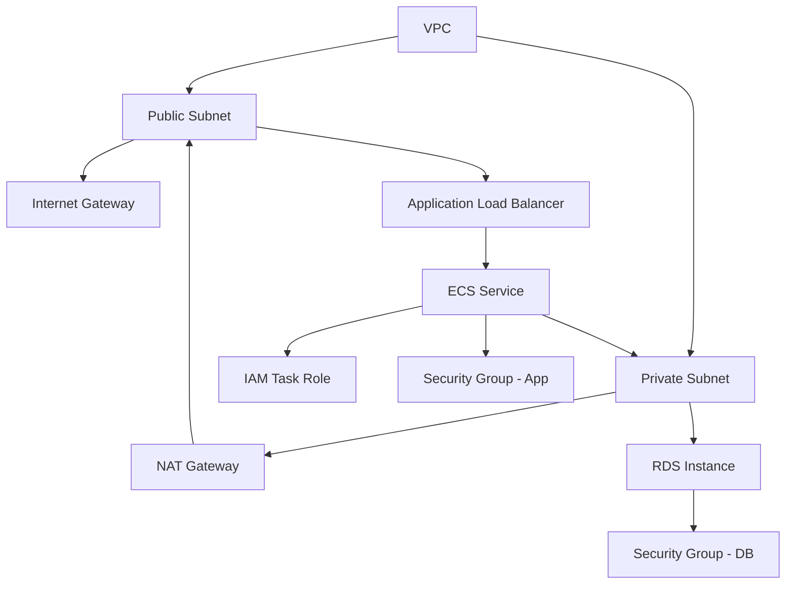

# [YOUR_INFRASTRUCTURE_NAME] Infrastructure Specification

> **Template**: Infrastructure as Code (IaC) specification template
> 
> **Customization Instructions**:
> - Replace all `[YOUR_*]` placeholders with your specific values
> - Remove sections not applicable to your infrastructure
> - Add additional sections as needed for your use case
> - Follow your organization's golden specs for cross-cutting concerns

<!--
CUSTOMIZATION GUIDE:
1. [YOUR_INFRASTRUCTURE_NAME]: Name of the infrastructure component (e.g., "API Gateway", "VPC Network", "ECS Cluster")
2. [YOUR_REGION]: AWS region(s) where this infrastructure will be deployed (e.g., "us-east-1", "eu-west-1")
3. [YOUR_ENVIRONMENT]: Environment names (e.g., "dev", "staging", "prod")
4. [YOUR_TEAM]: Team responsible for this infrastructure
5. [YOUR_COMPLIANCE_REQUIREMENT]: Any regulatory requirements (e.g., "PCI DSS", "HIPAA", "SOC 2", "N/A")
6. [YOUR_COST_CENTER]: Cost allocation tag or budget code

Delete this comment block after customization.
-->

---

## Intent

[ONE SENTENCE: What infrastructure component this provisions and why it's needed]

**Example**: "Provisions a multi-AZ VPC with public and private subnets to host containerized microservices with secure network isolation and internet access for API endpoints."

**Why it exists**: [Explain the business or technical problem this infrastructure solves]

**Example**: "Why it exists: Replaces legacy single-AZ deployment with high-availability architecture, reducing planned downtime from 4 hours/month to zero and meeting our 99.9% uptime SLA."

---

## Resources

### Primary Resources

#### [RESOURCE_TYPE_1]: [RESOURCE_NAME]
**Type**: [AWS::Service::ResourceType or equivalent]

**Configuration**:
```yaml
# HCL, CloudFormation, CDK, or Terraform syntax
[RESOURCE_NAME]:
  [property]: [value]
  # Add all relevant configuration properties
```

**Purpose**: [Why this resource is needed]

**Dependencies**: [List resources this depends on, if any]

**Example**:
```yaml
# Example: VPC Configuration
VPC:
  type: AWS::EC2::VPC
  properties:
    CidrBlock: 10.0.0.0/16
    EnableDnsHostnames: true
    EnableDnsSupport: true
    Tags:
      - Key: Name
        Value: [YOUR_INFRASTRUCTURE_NAME]-vpc
      - Key: Environment
        Value: [YOUR_ENVIRONMENT]
```

#### [RESOURCE_TYPE_2]: [RESOURCE_NAME]
**Type**: [AWS::Service::ResourceType]

**Configuration**:
```yaml
[RESOURCE_NAME]:
  [property]: [value]
```

**Purpose**: [Why this resource is needed]

**Dependencies**: [List resources this depends on]


### Supporting Resources

List all supporting resources (security groups, IAM roles, monitoring, etc.):

- **IAM Roles**: [List roles and their purposes]
- **Security Groups**: [List security groups and their ingress/egress rules]
- **CloudWatch Alarms**: [List alarms and their thresholds]
- **Backup Policies**: [Describe backup configuration if applicable]
- **Network ACLs**: [List network ACLs if applicable]

**Example**:
- **IAM Roles**:
  - `[YOUR_INFRASTRUCTURE_NAME]-lambda-execution-role`: Allows Lambda functions to write logs and access DynamoDB
  - `[YOUR_INFRASTRUCTURE_NAME]-ecs-task-role`: Allows ECS tasks to access S3 and Secrets Manager

- **Security Groups**:
  - `[YOUR_INFRASTRUCTURE_NAME]-alb-sg`: Allows inbound HTTPS (443) from internet, outbound to ECS tasks (8080)
  - `[YOUR_INFRASTRUCTURE_NAME]-ecs-sg`: Allows inbound from ALB security group only

---

## Constraints

### Security Constraints

#### 1. IAM Least Privilege
**Requirement**: All IAM policies must specify explicit resource ARNs. No wildcard (`*`) permissions except for read-only actions (Get*, List*, Describe*).

**Validation**: 
- ✓ Automated by `toolkit/hooks/security/validate-iam.yaml` hook
- ✓ Manual review during CDK synth/Terraform plan

**Implementation**:
```typescript
// ✓ CORRECT: Specific resource ARNs
lambdaRole.addToPolicy(new PolicyStatement({
  actions: ['dynamodb:GetItem', 'dynamodb:PutItem'],
  resources: ['arn:aws:dynamodb:[YOUR_REGION]:123456789012:table/[YOUR_TABLE_NAME]']
}));

// ✗ WRONG: Wildcard permissions (blocked by validate-iam.yaml)
// lambdaRole.addToPolicy(new PolicyStatement({
//   actions: ['dynamodb:*'],
//   resources: ['*']
// }));
```

#### 2. Encryption at Rest
**Requirement**: [Specify encryption requirements for data stores]

**Example**: "All DynamoDB tables must use AWS-managed KMS keys (aws/dynamodb). All S3 buckets must use SSE-S3 or SSE-KMS encryption."

**Validation**: 
- ✓ CDK synth output review
- ✓ AWS Config rules for encryption enforcement

#### 3. Encryption in Transit
**Requirement**: [Specify TLS/SSL requirements]

**Example**: "All API endpoints must use TLS 1.2 or higher. HTTP endpoints must redirect to HTTPS."

**Validation**: 
- ✓ API Gateway/ALB configuration review
- ✓ Security scanner checks for unencrypted endpoints

#### 4. Network Isolation
**Requirement**: [Specify network segmentation requirements]

**Example**: "Database instances must be in private subnets with no internet gateway. Application tiers in public subnets must use NAT Gateway for outbound internet access."

**Validation**: 
- ✓ Subnet route table review
- ✓ Network topology diagram validation


#### 5. Secrets Management
**Requirement**: [Specify how secrets and credentials are managed]

**Example**: "All API keys, passwords, and certificates must be stored in AWS Secrets Manager. No hardcoded credentials in infrastructure code. Secrets must be rotated every 90 days."

**Validation**: 
- ✓ Automated by `toolkit/hooks/security/scan-secrets.yaml` hook
- ✓ Secret rotation Lambda function configured

### Reliability Constraints

#### 6. High Availability
**Requirement**: [Specify availability requirements and multi-AZ configuration]

**Example**: "Infrastructure must span at least 2 availability zones. Single points of failure not permitted for production workloads."

**Validation**: 
- ✓ Resource placement review (ensure distribution across AZs)
- ✓ Failure scenario testing (AZ failure simulation)

#### 7. Backup and Recovery
**Requirement**: [Specify backup requirements and RPO/RTO targets]

**Example**: "DynamoDB tables must have point-in-time recovery enabled. Backups retained for 30 days. Recovery Point Objective (RPO): 1 hour. Recovery Time Objective (RTO): 4 hours."

**Validation**: 
- ✓ Backup configuration review
- ✓ Quarterly disaster recovery drill

#### 8. Auto-scaling
**Requirement**: [Specify auto-scaling configuration]

**Example**: "ECS services must auto-scale between 2-10 tasks based on CPU utilization (target: 70%). Lambda concurrent executions limited to 100 per function."

**Validation**: 
- ✓ Auto-scaling policy configuration review
- ✓ Load testing to verify scaling behavior


### Performance Constraints

#### 9. Latency Requirements
**Requirement**: [Specify latency thresholds for API endpoints or data access]

**Example**: "API Gateway endpoints must respond within 200ms at p95. Database queries must complete within 100ms at p99."

**Validation**: 
- ✓ Load testing with CloudWatch metrics
- ✓ X-Ray tracing analysis

#### 10. Throughput Requirements
**Requirement**: [Specify throughput capacity]

**Example**: "Infrastructure must support 1000 requests/second sustained load with burst capacity to 5000 requests/second."

**Validation**: 
- ✓ Load testing results
- ✓ CloudWatch metrics for request rates

### Compliance Constraints

#### 11. Regulatory Compliance
**Requirement**: [YOUR_COMPLIANCE_REQUIREMENT] - [Describe specific compliance requirements]

**Example**: "PCI DSS Level 1 compliant: All cardholder data environments (CDE) must be isolated in dedicated subnets. Network traffic logs retained for 12 months."

**Validation**: 
- ✓ Annual compliance audit
- ✓ AWS Config compliance pack evaluation

#### 12. Data Residency
**Requirement**: [Specify data residency and sovereignty requirements]

**Example**: "All customer data must remain within [YOUR_REGION]. Cross-region replication prohibited for EU customer data per GDPR requirements."

**Validation**: 
- ✓ S3 bucket region configuration review
- ✓ Database instance location verification

### Cost Constraints

#### 13. Budget Limits
**Requirement**: [Specify budget constraints]

**Example**: "Monthly infrastructure costs must not exceed $5,000 for dev environment, $20,000 for prod environment. Cost Center: [YOUR_COST_CENTER]"

**Validation**: 
- ✓ AWS Budgets alerts configured
- ✓ Monthly cost review

#### 14. Resource Optimization
**Requirement**: [Specify resource optimization requirements]

**Example**: "Unused resources must be terminated within 7 days. Non-production environments must use Reserved Instances or Savings Plans. Lambda functions must use ARM64 architecture where possible for cost savings."

**Validation**: 
- ✓ AWS Trusted Advisor recommendations review
- ✓ Cost Explorer analysis for optimization opportunities

---

## Design Decisions

### Decision 1: [INFRASTRUCTURE_PATTERN_CHOICE]
**Chosen**: [Selected approach]

**Alternatives Considered**:
- [Alternative 1]: [Why rejected]
- [Alternative 2]: [Why rejected]

**Rationale**: [Why the chosen approach is best for this use case]

**Trade-offs**: [What you're accepting with this choice]

**Example**:
**Chosen**: AWS CDK (TypeScript) for infrastructure definition

**Alternatives Considered**:
- Terraform: Rejected due to limited type safety and existing team expertise in TypeScript
- CloudFormation YAML: Rejected due to verbosity and lack of reusable constructs

**Rationale**: CDK provides type-safe infrastructure definitions, reusable constructs, and strong IDE support. Team already familiar with TypeScript from application development.

**Trade-offs**: CDK introduces CloudFormation as abstraction layer. Stack updates may be slower than pure Terraform. Accepting this for improved development experience.

### Decision 2: [DEPLOYMENT_STRATEGY]
**Chosen**: [Selected deployment approach]

**Example**:
**Chosen**: Blue-Green deployment via CloudFormation stack sets

**Alternatives Considered**:
- Rolling updates: Rejected due to longer rollback time in case of issues
- Canary deployments: Deferred to future iteration (requires additional routing logic)

**Rationale**: Blue-Green provides instant rollback capability and zero-downtime deployments for infrastructure changes. Critical for production stability.

**Trade-offs**: Temporarily requires 2x infrastructure capacity during deployment. Cost increase acceptable for deployment safety.

### Decision 3: [MONITORING_APPROACH]
**Chosen**: [Selected monitoring solution]

**Example**:
**Chosen**: CloudWatch Logs + CloudWatch Metrics + X-Ray tracing

**Alternatives Considered**:
- Third-party APM (Datadog): Rejected due to cost ($50/host/month) and data egress concerns
- ELK Stack: Rejected due to operational overhead of managing Elasticsearch cluster

**Rationale**: CloudWatch provides native integration with AWS services, no data egress costs, and sufficient observability for our use case.

**Trade-offs**: Query capabilities less powerful than Elasticsearch. Log analysis requires CloudWatch Insights query language familiarity.

---

## Test Expectations

### Validation Tests

Infrastructure must pass these validation checks before deployment:

#### 1. Static Analysis
- ✓ `cdk synth` or `terraform plan` completes without errors
- ✓ No security findings from `checkov` or `tfsec` scans
- ✓ IAM policy validation passes (no wildcard permissions)

#### 2. Integration Tests
- ✓ Test stack deploys successfully to isolated test account
- ✓ All resources create successfully with expected configuration
- ✓ Security group rules allow expected traffic patterns
- ✓ IAM roles have correct trust relationships and policies

#### 3. Smoke Tests
After deployment to each environment:
- ✓ Health check endpoint returns 200 OK
- ✓ Database connection pool initializes successfully
- ✓ All CloudWatch alarms in OK state (not alarming)
- ✓ No IAM permission denied errors in CloudWatch Logs

#### 4. Performance Tests
- ✓ Load test confirms infrastructure meets throughput requirements
- ✓ Latency metrics within acceptable thresholds (p95 < [YOUR_THRESHOLD])
- ✓ Auto-scaling triggers correctly under load

#### 5. Disaster Recovery Tests
- ✓ Backup restoration completes within RTO ([YOUR_RTO])
- ✓ Cross-region failover works (if applicable)
- ✓ Rollback procedure completes successfully

**Test Automation**:
```bash
# Example test script structure
./scripts/validate-infra.sh --env dev
# Runs: static analysis, deploy to test account, smoke tests

./scripts/load-test.sh --env staging --duration 10m
# Runs: performance and scaling validation

./scripts/dr-drill.sh --env prod-backup
# Runs: disaster recovery simulation
```

---

## Rollback Plan

**Critical**: Infrastructure changes must be reversible. Test rollback procedures regularly.

### Rollback Triggers

Initiate rollback if any of these conditions occur within 1 hour of deployment:

1. **Error Rate Spike**: HTTP 5xx error rate exceeds 1% of requests
2. **Latency Degradation**: p95 latency exceeds baseline by 50%
3. **Availability Drop**: Health check success rate falls below 99%
4. **CloudWatch Alarms**: Any CRITICAL alarm fires
5. **Application Errors**: New error patterns in CloudWatch Logs

### Rollback Procedures

#### For CloudFormation/CDK Stacks:

```bash
# Option 1: Rollback via CloudFormation console
# Navigate to CloudFormation > Stacks > [YOUR_STACK_NAME]
# Actions > Roll back

# Option 2: Rollback via CLI
aws cloudformation rollback-stack \
  --stack-name [YOUR_INFRASTRUCTURE_NAME]-prod \
  --region [YOUR_REGION]

# Option 3: Redeploy previous version
cdk deploy --version-reporting false \
  --require-approval never \
  [YOUR_INFRASTRUCTURE_NAME]-prod
```

#### For Terraform:

```bash
# Revert to previous state
cd infrastructure/
git checkout [PREVIOUS_COMMIT_HASH]
terraform plan -out=rollback.tfplan
terraform apply rollback.tfplan

# Or restore from state backup
terraform state pull > current.tfstate
cp terraform.tfstate.backup terraform.tfstate
terraform apply
```

### Rollback Validation

After rollback completes:

1. ✓ Verify infrastructure returns to stable state (all alarms clear)
2. ✓ Confirm error rates return to baseline
3. ✓ Check CloudWatch Logs for any new errors
4. ✓ Run smoke tests to confirm functionality
5. ✓ Document rollback incident in post-mortem

### Non-Reversible Changes

**Warning**: These infrastructure changes cannot be safely rolled back automatically:

- **Database schema changes**: Requires application compatibility layer
- **S3 bucket deletion**: Data loss if bucket emptied
- **IAM role deletion**: May break running applications immediately
- **KMS key deletion**: Encrypted data becomes inaccessible

**Mitigation**: For these changes, use phased rollout approach:
1. Deploy new infrastructure alongside old (parallel run)
2. Gradually migrate traffic/data to new infrastructure
3. Deprecate old infrastructure only after validation period

### Rollback Time Estimate

- **Target**: Rollback completes within 15 minutes
- **CloudFormation rollback**: 5-10 minutes (automated)
- **Terraform state restore**: 10-15 minutes (semi-automated)
- **Manual recovery**: 30-60 minutes (if automation fails)

---

## State Management

### State Storage

**For Terraform**:
```hcl
# backend.tf
terraform {
  backend "s3" {
    bucket         = "[YOUR_TEAM]-terraform-state"
    key            = "[YOUR_INFRASTRUCTURE_NAME]/terraform.tfstate"
    region         = "[YOUR_REGION]"
    encrypt        = true
    dynamodb_table = "[YOUR_TEAM]-terraform-locks"
  }
}
```

**For CDK/CloudFormation**:
- State managed automatically by CloudFormation service
- Stack outputs stored in Parameter Store for cross-stack references

### State Locking

- ✓ DynamoDB table configured for Terraform state locking
- ✓ Concurrent modifications prevented
- ✓ Lock timeout: 10 minutes

### State Backup

- ✓ Automated state backups every 6 hours
- ✓ Retention period: 30 days
- ✓ Stored in S3 with versioning enabled
- ✓ Backup location: `s3://[YOUR_TEAM]-terraform-state/backups/`

---

## Resource Dependencies

### Dependency Graph



**Creation Order**:
1. VPC, Subnets
2. Internet Gateway, NAT Gateway
3. Route Tables, Routes
4. Security Groups
5. IAM Roles, Policies
6. RDS Instance, DynamoDB Tables
7. ECS Cluster, Task Definitions
8. Application Load Balancer
9. ECS Services, Auto-scaling

**Deletion Order**: Reverse of creation order

### External Dependencies

List any external resources this infrastructure depends on:

- **Shared VPC**: [VPC ID or reference]
- **DNS Hosted Zone**: [Route53 zone ID]
- **KMS Keys**: [Key IDs for encryption]
- **ECR Repositories**: [Container image repositories]

---

## Deployment Pipeline

### CI/CD Stages

```yaml
# Example pipeline configuration
stages:
  - validate     # Syntax checks, linting, security scans
  - plan         # Generate infrastructure changes (terraform plan / cdk diff)
  - approve      # Manual approval gate for production
  - deploy       # Apply infrastructure changes
  - test         # Smoke tests, integration tests
  - monitor      # Post-deployment monitoring period
```

### Deployment Environments

| Environment | Purpose | Approval Required | Deployment Trigger |
|-------------|---------|-------------------|-------------------|
| dev | Development testing | No | Automatic on merge to `develop` |
| staging | Pre-production validation | No | Automatic on merge to `main` |
| prod | Production | Yes (manual) | Manual trigger after staging validation |

### Deployment Windows

- **Non-production**: Anytime
- **Production**: Tuesday-Thursday, 10:00 AM - 2:00 PM [YOUR_TIMEZONE]
- **Freeze periods**: No deployments during holiday periods or major sales events

### Approval Process

Production deployments require approval from:
- ✓ Infrastructure team lead
- ✓ Application team lead (if changes affect application)
- ✓ Security team (if security-impacting changes)

---

## Monitoring and Alerts

### Key Metrics

Monitor these metrics for infrastructure health:

| Metric | Threshold | Action |
|--------|-----------|--------|
| HTTP 5xx Error Rate | > 1% | Page on-call engineer |
| API Latency (p95) | > 500ms | Alert team channel |
| DynamoDB Throttled Requests | > 10/min | Increase provisioned capacity |
| Lambda Errors | > 5/min | Alert team channel |
| ECS Task Count | < 2 | Page on-call engineer |

### CloudWatch Alarms

```typescript
// Example alarm configuration
new cloudwatch.Alarm(this, 'HighErrorRate', {
  metric: alb.metricHttpCodeTarget(HttpCodeTarget.TARGET_5XX_COUNT),
  threshold: 10,
  evaluationPeriods: 2,
  datapointsToAlarm: 2,
  comparisonOperator: cloudwatch.ComparisonOperator.GREATER_THAN_THRESHOLD,
  treatMissingData: cloudwatch.TreatMissingData.NOT_BREACHING,
});
```

### Log Aggregation

- **Application Logs**: CloudWatch Logs, log group: `/aws/[YOUR_INFRASTRUCTURE_NAME]/app`
- **Infrastructure Logs**: CloudWatch Logs, log group: `/aws/[YOUR_INFRASTRUCTURE_NAME]/infra`
- **Retention Period**: 30 days for dev, 90 days for prod
- **Log Insights Queries**: Stored in `scripts/queries/` directory

---

## Cost Monitoring

### Cost Allocation Tags

All resources must be tagged with:

```yaml
Tags:
  - Key: Project
    Value: [YOUR_INFRASTRUCTURE_NAME]
  - Key: Environment
    Value: [YOUR_ENVIRONMENT]
  - Key: CostCenter
    Value: [YOUR_COST_CENTER]
  - Key: ManagedBy
    Value: Terraform|CDK|CloudFormation
  - Key: Owner
    Value: [YOUR_TEAM]
```

### Budget Alerts

- ✓ Alert at 80% of monthly budget
- ✓ Alert at 100% of monthly budget
- ✓ Alert on anomalous spending (>20% increase week-over-week)

### Cost Optimization Checklist

- [ ] Reserved Instances purchased for steady-state workloads
- [ ] Savings Plans evaluated for compute capacity
- [ ] Unused resources identified and terminated monthly
- [ ] Auto-scaling configured to reduce costs during off-hours
- [ ] S3 lifecycle policies configured to move data to cheaper storage tiers
- [ ] CloudWatch Log retention periods optimized

---

## Maintenance Windows

### Patching Schedule

- **OS patches**: Monthly, second Tuesday, 2:00 AM - 4:00 AM [YOUR_TIMEZONE]
- **Database patches**: Quarterly, during low-traffic periods
- **Infrastructure updates**: As needed, following deployment windows

### Upgrade Policy

- **Minor version upgrades**: Automatic, during patching windows
- **Major version upgrades**: Manual, with change request and rollback plan

---

## References

### Documentation
- Internal docs: [Link to your internal documentation]
- AWS Service docs: [Links to relevant AWS documentation]
- Architecture decision records (ADRs): [Link to ADR repository]

### Related Specifications
- Application Spec: [Link to application specification]
- Security Baseline: [Link to security requirements]
- Disaster Recovery Plan: [Link to DR documentation]

### Contacts
- **Infrastructure Team**: [YOUR_TEAM] - [team-email@example.com]
- **On-call**: [Pager duty / on-call schedule link]
- **Slack Channel**: #[your-infrastructure-channel]

---

## Quick Start Guide

### Prerequisites
- AWS CLI configured with appropriate credentials
- CDK/Terraform installed locally
- Access to deployment repository

### Deployment Steps

1. **Clone infrastructure repository**
   ```bash
   git clone [YOUR_REPO_URL]
   cd [YOUR_INFRASTRUCTURE_NAME]
   ```

2. **Configure environment variables**
   ```bash
   export AWS_REGION=[YOUR_REGION]
   export ENVIRONMENT=[YOUR_ENVIRONMENT]
   ```

3. **Review planned changes**
   ```bash
   # For CDK
   cdk diff [YOUR_INFRASTRUCTURE_NAME]-$ENVIRONMENT
   
   # For Terraform
   terraform plan -var-file=environments/$ENVIRONMENT.tfvars
   ```

4. **Deploy infrastructure**
   ```bash
   # For CDK
   cdk deploy [YOUR_INFRASTRUCTURE_NAME]-$ENVIRONMENT
   
   # For Terraform
   terraform apply -var-file=environments/$ENVIRONMENT.tfvars
   ```

5. **Verify deployment**
   ```bash
   ./scripts/smoke-test.sh --env $ENVIRONMENT
   ```

### Teardown

To destroy infrastructure (non-production only):

```bash
# For CDK
cdk destroy [YOUR_INFRASTRUCTURE_NAME]-dev

# For Terraform
terraform destroy -var-file=environments/dev.tfvars
```

**Warning**: Always backup data before destroying infrastructure. Some deletions are irreversible.

---

## Appendix: Common Patterns

### Multi-Region Deployment

For multi-region infrastructure:

```typescript
// Example: Deploy to multiple regions
const regions = ['us-east-1', 'eu-west-1', 'ap-southeast-1'];

regions.forEach(region => {
  new InfraStack(app, `InfraStack-${region}`, {
    env: { region },
    // Stack configuration
  });
});
```

### Cross-Account Deployment

For cross-account infrastructure access:

```typescript
// Assume role in target account
const targetAccount = '123456789012';
const targetRole = `arn:aws:iam::${targetAccount}:role/DeploymentRole`;

// Configure stack with cross-account role
new InfraStack(app, 'CrossAccountStack', {
  env: { 
    account: targetAccount,
    region: 'us-east-1'
  },
  // Role to assume for deployment
  roleArn: targetRole
});
```

### Shared Resources

For resources shared across multiple stacks:

```typescript
// Export from shared stack
export class SharedStack extends Stack {
  public readonly vpc: ec2.IVpc;
  
  constructor(scope: Construct, id: string, props?: StackProps) {
    super(scope, id, props);
    
    this.vpc = new ec2.Vpc(this, 'SharedVpc', {
      // VPC configuration
    });
    
    // Export for use by other stacks
    new CfnOutput(this, 'VpcId', {
      value: this.vpc.vpcId,
      exportName: 'SharedVpcId'
    });
  }
}

// Import in dependent stack
const vpcId = Fn.importValue('SharedVpcId');
const vpc = ec2.Vpc.fromLookup(this, 'ImportedVpc', {
  vpcId: vpcId
});
```

---

## Version History

| Version | Date | Author | Changes |
|---------|------|--------|---------|
| 1.0.0 | YYYY-MM-DD | [YOUR_NAME] | Initial infrastructure specification |

---

**Document Owner**: [YOUR_TEAM]  
**Last Updated**: [DATE]  
**Review Frequency**: Quarterly or after major infrastructure changes
